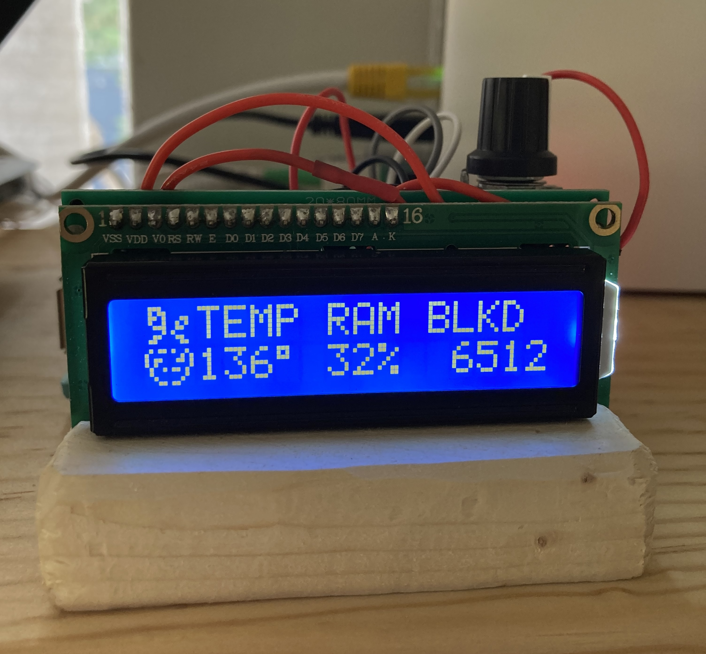
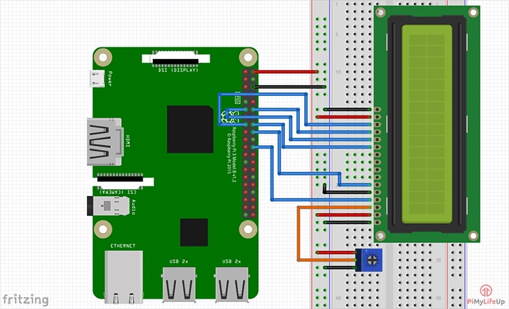

# Pihole Screen
---------------------------
This is some quick and easy CircuitPython code for displaying PiHole stats on an LCD1602 display with the Adafruit character LCD library. 

Stats are obtained via using the PiHole's API and authenticating with the password. The given session ID and CSRF tokens are then used to grab data from relevant endpoints. This is easy to call from a cronjob at your desired interval. 

The PiHole image is made by creating four custom characters which are defined by a binary pattern. 

The pinning connections used are from [PiUpMyLife](https://pimylifeup.com/raspberry-pi-lcd-16x2/). Basically, 

    1. Pin 1 (Ground) goes to the ground rail.
    2. Pin 2 (VCC/5v) goes to the positive rail.
    3. Pin 3 (V0) goes to the middle wire of the potentiometer.
    4. Pin 4 (RS) goes to GPIO25 (Pin 22)
    5. Pin 5 (RW) goes to the ground rail.
    6. Pin 6 (EN) goes to GPIO24 (Pin 18)
    7. Pin 11 (D4) goes to GPIO23 (Pin 16)
    8. Pin 12 (D5) goes to GPIO17 (Pin 11)
    9. Pin 13 (D6) goes to GPIO18 (Pin 12)
    10. Pin 14 (D7) goes to GPIO22 (Pin 15)
    11. Pin 15 (LED +) goes to the positive rail.
    12. Pin 16 (LED -) goes to the ground rail.

Note that the pi has a ton of GPIO pins which can be substituted, so you can use whichever ones you want. Just change it in the code.

I also added an additional potentiometer as a variable resistor so I could dim the LED backlight, since, in a dark room, full brightness on the LCD1602 is way too bright. 
